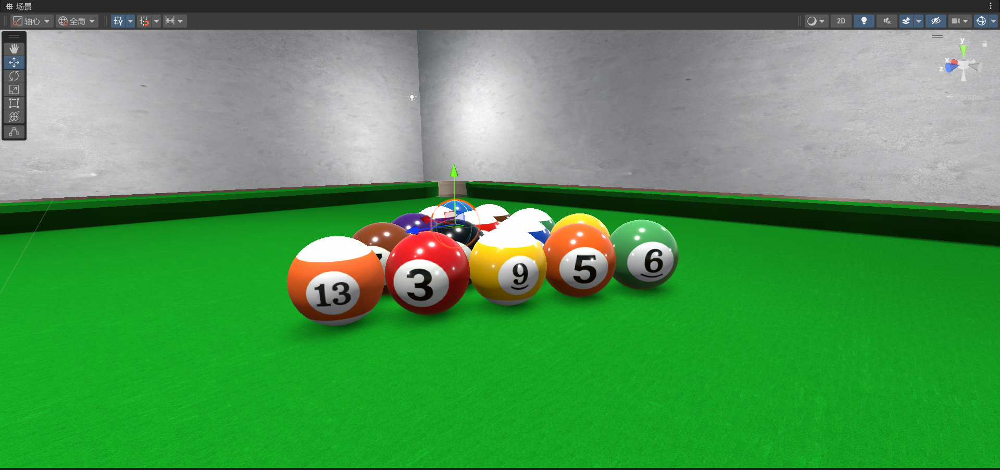
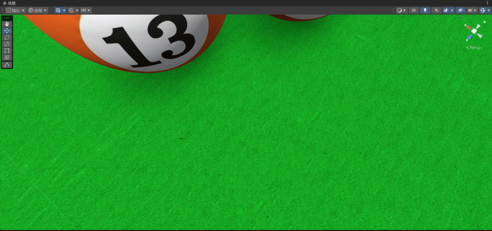
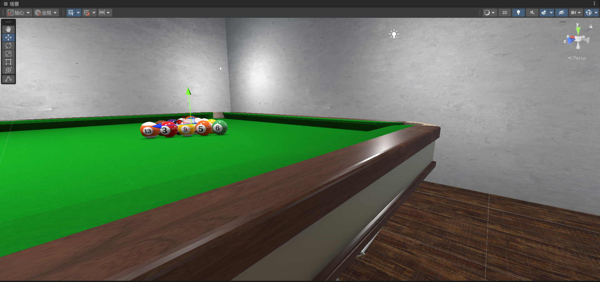
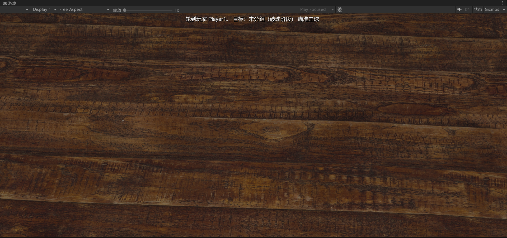
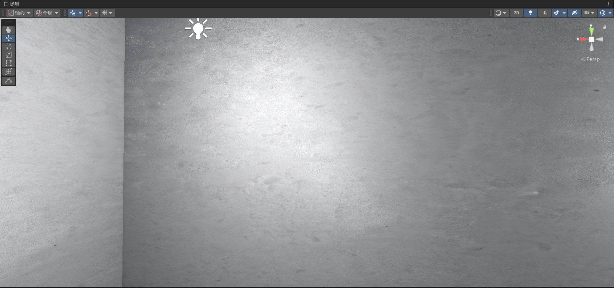
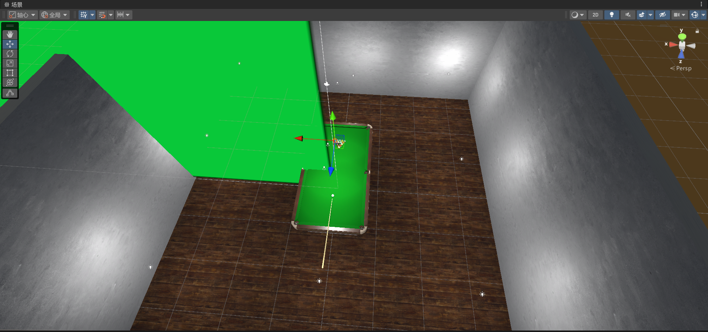

# 个人报告 - 陈俊鑫

## 一、项目概述

本人在台球游戏项目中主要负责Unity引擎的美术渲染工作，包括物体材质设置、贴图制作与应用、以及光照渲染等核心视觉效果的实现。

## 二、主要工作内容

### 2.1 台球材质与贴图制作

台球作为游戏的核心物体，其材质的真实感至关重要。我在制作过程中重点关注了以下几个方面：

#### 材质设置
- **Shader选择**：采用Unity的Standard Shader（标准着色器），利用其基于物理的渲染（PBR）特性来模拟真实台球的表面效果
- **Albedo贴图**：为不同编号的台球（1-15号球）制作了彩色和条纹两种风格的基础颜色贴图，确保每个球的标识清晰可辨
- **Metallic/Smoothness**：将金属度设置为较低值（约0.1），平滑度设置为较高值（约0.85-0.9），模拟台球表面光滑但非金属的特性

- 

#### 高光反射效果
通过调整环境反射探针（Reflection Probe）和光源配置，使台球表面能够正确反射周围环境，尤其是顶部照明灯的高光点，这是台球真实感的关键要素。

### 2.2 台球布材质设计

台球桌面的绒布是玩家视线的主要焦点区域，需要特别注意材质的细节表现。

#### 材质特性
- **颜色选择**：采用经典的绿色台呢，RGB值精确调整以符合标准台球桌的视觉效果
- **布料质感**：
  - 使用自定义的布料纹理贴图，展现绒布的纤维质感
  - 通过Normal Map表现布料表面的细微起伏和编织纹理
  - 调整Smoothness值（约0.3-0.4），使表面呈现出柔和的漫反射效果，避免过强的镜面反射
- **光照响应**：调整材质的反照率，使台球布在不同光照角度下呈现出自然的明暗变化

- 

### 2.3 台球桌木质边框材质

台球桌的边框采用深色实木材质，需要体现出木材的重量感和质感。

#### 木材质感实现
- **Albedo贴图**：使用高分辨率的深色木纹贴图，表现出木材的天然纹理和年轮
- **光泽度调整**：设置中等偏高的平滑度（约0.6-0.7），模拟抛光处理后的实木表面

- 

### 2.4 房间木质地板

地板材质的设计需要营造出舒适的室内环境氛围。

#### 地板材质配置
- **贴图制作**：
  - 使用无缝拼接的木地板纹理，确保大面积铺设时无明显重复感
  - 使用法线贴图增强木纹的立体感
- **磨损效果**：在高频使用区域（如台球桌周围）添加了轻微的磨损和划痕效果
- **反射设置**：
  - 调整反射强度，使地板呈现出适度的光泽，但不至于过度反光
- **细节优化**：通过细分UV和增加纹理细节，确保地板在各个角度都有良好的视觉效果

- 

### 2.5 水泥墙面材质

墙面采用现代工业风格的水泥材质，为整体场景提供了坚实的视觉基础。

#### 水泥质感表现
- **基础材质**：
  - 使用灰色调的水泥纹理，包含自然的色差和斑驳效果
  - Normal Map表现水泥表面的粗糙质感和不规则纹理
- **真实感细节**：
  - 添加污渍、水渍等风化效果的贴图层
- **光照响应**：
  - 低平滑度设置（约0.2），呈现粗糙的漫反射表面
  - 通过调整反照率，使墙面在不同光照下呈现出自然的明暗渐变

- 

### 2.6 场景光照设计

光照是营造游戏氛围的关键要素，我采用了混合照明方案。

#### 主光源配置
- **顶部聚光灯**：
  - 在台球桌正上方设置了主要的聚光灯（Spot Light）
  - 模拟专业台球厅的照明效果，光线集中在游戏区域
  - 调整光照强度、范围和衰减曲线，确保台球桌受到充分照明
  
- 

#### 辅助光源
- **补光设置**：在场景的几个关键位置放置了低强度的点光源或面光源，填补阴影区域
- **边缘光**：适当添加边缘光源，突出物体轮廓，增强视觉层次感

## 三、技术难点与解决方案

### 3.1 台球高光反射的真实感
**问题**：初期台球表面的高光过于生硬，缺乏真实感。

**解决方案**：
- 通过精细调整Smoothness和Metallic参数找到最佳平衡点
- 增加环境反射探针并调整其位置和分辨率
- 使用自定义的环境贴图（Cubemap）增强反射效果

### 3.2 台球布的光照表现
**问题**：布料材质在不同角度光照下表现不自然，容易出现过暗或过亮的情况。

**解决方案**：
- 调整材质的反照率曲线，使其更符合绒布的光学特性
- 优化Normal Map的强度，避免过度的凹凸感

## 四、学习收获与心得体会
通过这个项目，我深入学习了Unity的材质系统和光照系统，特别是：
- 对PBR渲染流程有了更深刻的理解
- 掌握了各类贴图的制作和应用技巧
- 学会了如何平衡视觉质量和运行性能

细节决定成败。台球表面的高光、木纹的方向、布料的质感，这些看似微小的元素组合在一起，才能营造出真实可信的游戏世界。
## 五、未来改进方向

1. **动态光照**：可以添加更多的动态光影效果，如台球运动时的动态阴影优化
2. **更多后期效果**：探索更多的后期处理效果，如景深、运动模糊等，增强画面表现力
