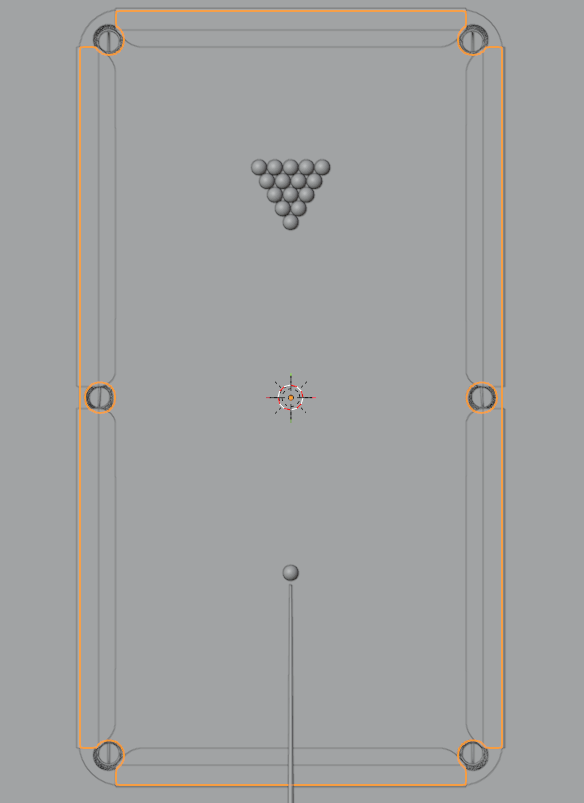
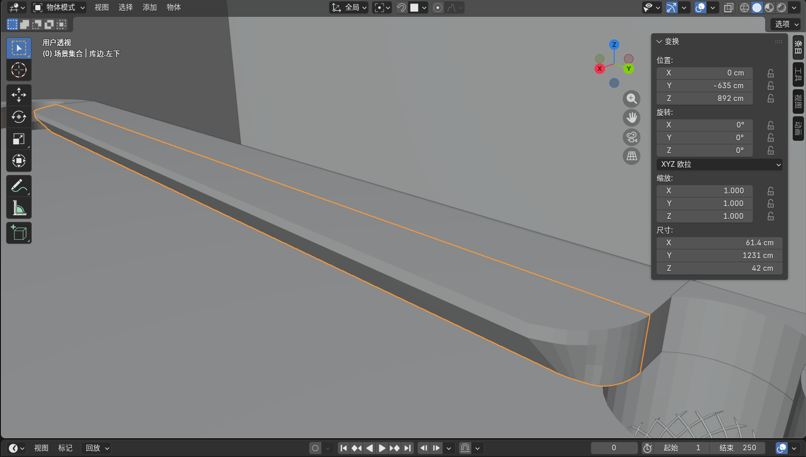
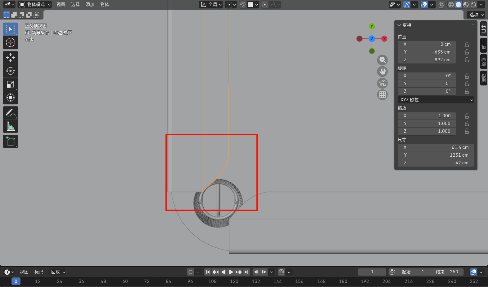
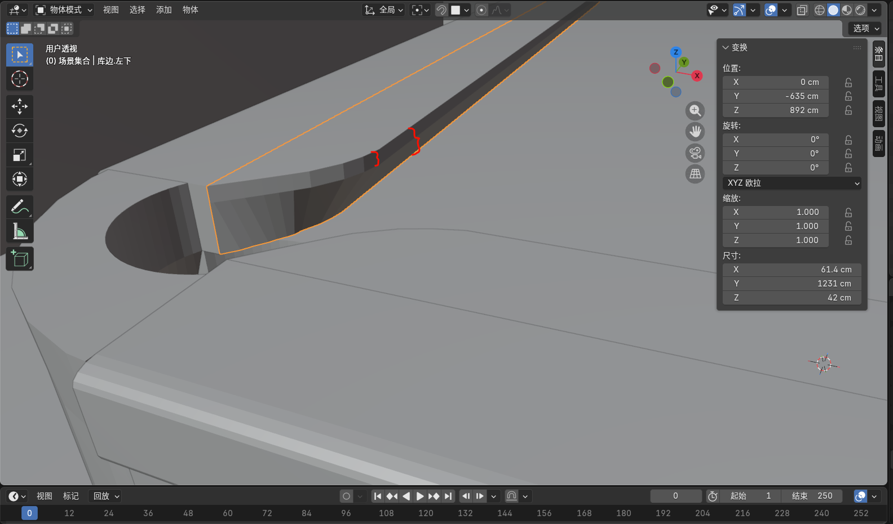
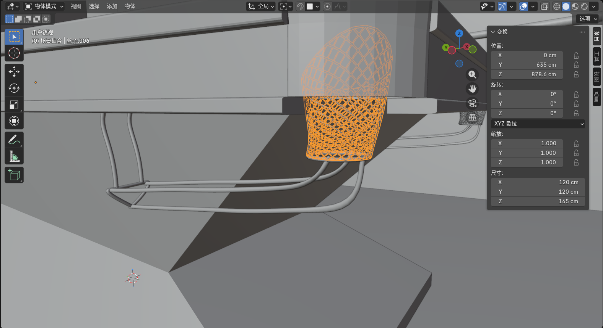
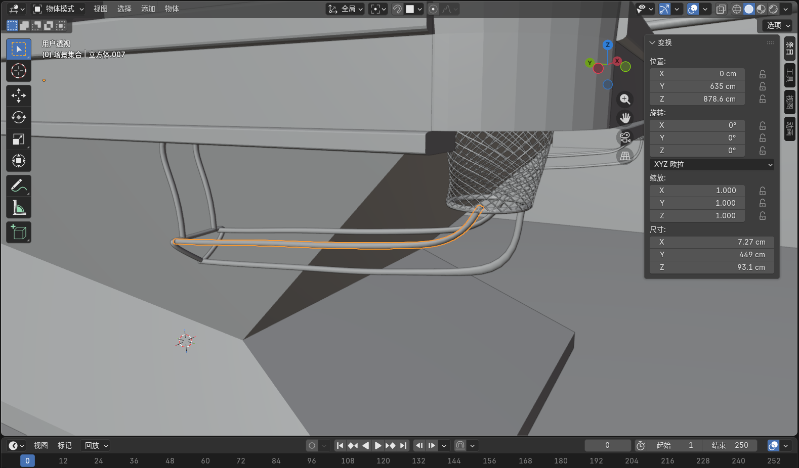
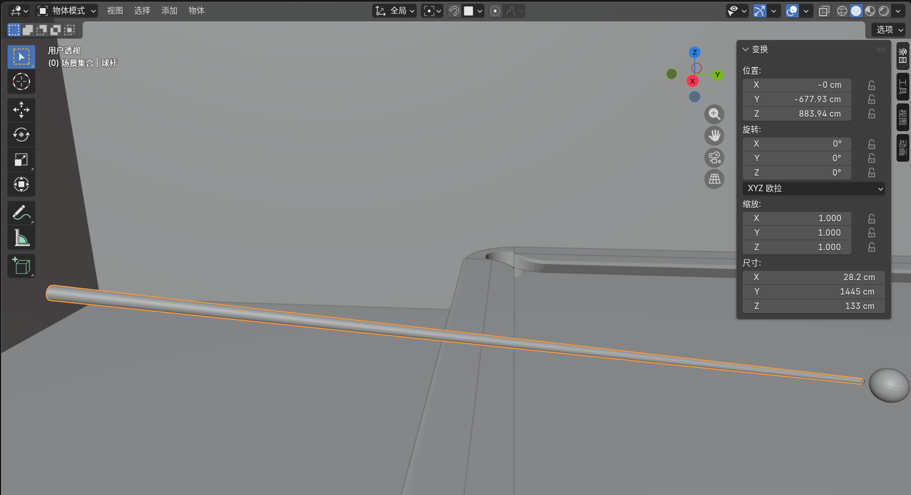
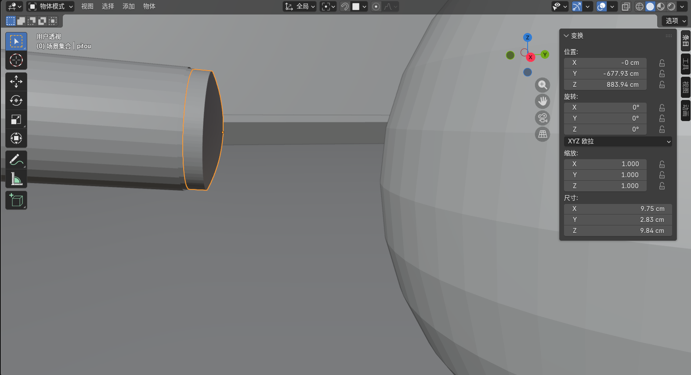

# 
 个人心得 

> - 23336050
> - 陈泽义
### 一、负责的工作
- 建模台球桌、台球、球杆等一系列模型
- 为了方便 Unity 里面贴图，提前准备好 UV 展开图，设置好 UV 坐标

### 二、心得体会
- 在着手这个项目之前，我没有接触过 Blender 软件，所以一开始我花了不少时间去学习 Blender 的基本操作和建模方法。通过观看教程视频和查阅相关资料，我逐渐掌握了建模的基本技巧，并能够独立完成简单的模型制作。
- 接着我查阅相关的台球桌和台球的资料，了解它们的结构、外观特点和尺寸。在建模过程中，我注重细节的还原，力求使模型尽可能接近真实物体。
- 对于难度较高的模型（这里面难度最高的应该是库边的建模），我尝试了多种方法，最终选择了使用布尔运算来实现复杂的形状。
- 在建模完成后，我还需要为模型进行 UV 展开和贴图设置。这一过程对于模型的最终效果至关重要，因此我花费了大量时间来调整 UV 坐标，确保贴图能够正确显示在模型表面。

### 三、部分模型建模思路
#### 1. 台球桌面板
- 台球桌面板的建模相对简单，主要是一个长方体。我通过调整长方体的尺寸来符合实际台球桌的比例。然后使用布尔调整器，使用圆柱去裁剪出球袋的位置，最后对边缘进行倒角处理，使其更加圆润。
- 

#### 2. 台球桌库边
- 台球桌库边的建模较为复杂.
- 
- 在袋口位置，库边不是一个简单的扇形，而是先有弧度再接近直线
  - 
  - 我使用了样条曲线（Bezier Curve）来绘制库边的轮廓线，然后通过挤出（Extrude）功能将其转换为三维模型。
- 在建模过程中，我还注意到了库边的厚度和高度，确保其与实际台球桌一致。
  - 

#### 3. 库边台球网
- 台球网使用了圆柱体切割与"un-subdivide"细分结合的方式进行建模
  - 

#### 4. 台球放置栏
- 
- 使用贝塞尔曲线绘制大概走向，然后挤出成型，最后进行细节处理。

#### 5. 台球杆
- 台球杆的建模相对简单，主要是一个长圆柱体。我通过调整圆柱体的尺寸来符合实际台球杆的比例。然后对杆头进行细节处理（创建皮头），使其更加逼真。
  - 
  - 
